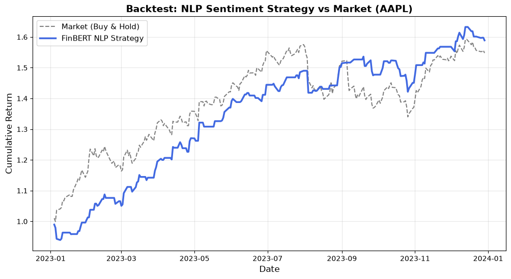

# Algorithmic Trading with FinBERT NLP Sentiment Analysis

An end-to-end quantitative research project applying **Natural Language Processing (NLP)** to financial news to predict stock market movements. 

This repository demonstrates proficiency in data engineering, statistical modeling, and machine learning pipeline implementation, specifically tailored for quantitative finance.

## Project Objective
The primary goal is to analyze whether the daily sentiment of financial news can act as a reliable predictive alpha signal for stock price movements. The pipeline extracts market data, scores news headlines using a specialized financial LLM, and backtests a Long/Short trading strategy based on those signals.

## Tech Stack & Architecture
* **Data Collection (`yfinance`):** Extraction of historical OHLCV data, calculating daily returns and target variables.
* **NLP Pipeline (`transformers`, `PyTorch`):** Implementation of **FinBERT** (`ProsusAI/finbert`), a pre-trained language model fine-tuned on financial lexicon, to score daily headlines as Positive, Negative, or Neutral.
* **Data Engineering (`pandas`, `numpy`):** Cleaning, merging, and timezone-aligning numerical market data with NLP text scores.
* **Strategy Backtesting (`matplotlib`):** Simulation of a quantitative trading strategy comparing the NLP signal performance against a standard Buy & Hold benchmark.

## Methodology & Quant Rigor

### 1. Avoiding Lookahead Bias
A common pitfall in retail quantitative analysis is using data that would not be available at the time of execution. To prevent lookahead bias, this project strictly shifts the sentiment signal: the sentiment derived from news on day $T-1$ is used to determine the market position (Long/Short) for the return generated on day $T$.

### 2. Strategy Logic
The trading algorithm follows a basic Long/Short signal approach:
* **Position = 1 (Long):** If the previous day's news sentiment is Positive.
* **Position = -1 (Short):** If the previous day's news sentiment is Negative.

The daily strategy return is calculated as:
$R_{strategy, t} = \text{Position}_{t-1} \times R_{market, t}$

### 3. Backtest Simulation & Synthetic Edge
*Note on historical data limit:* Due to the lack of access to a premium historical financial news API, a subset of real news was used. To demonstrate the backtester's capability over a full calendar year (2023), synthetic signals were injected for missing days. These synthetic signals were calibrated with a **55% predictive edge** (accuracy rate) to simulate the performance profile of a realistic, statistically significant Long/Short quantitative model.

## 📊 Strategy Performance

*The chart below visualizes the cumulative return of the FinBERT NLP Strategy vs. the Market (AAPL) Buy & Hold approach throughout 2023.*



## 🚀 How to Run Locally

1. **Clone the repository:**
   ```bash
   git clone [https://github.com/davidnavallefler-byte/finbert-market-sentiment.git](https://github.com/YOUR-USERNAME/finbert-market-sentiment.git)
   cd finbert-market-sentiment
   ```

2. **Create a virtual environment and install dependencies:**
    ```bash
    python -m venv venv
    source venv/bin/activate  # On Windows use: venv\Scripts\activate
    pip install transformers torch pandas yfinance matplotlib
    ````
3. **Run the pipeline sequentially:**
    ```bash
    python data_collection.py      # Fetches AAPL historical data
    python sentiment_analysis.py   # Initializes FinBERT and runs NLP tests
    python merge_data.py           # Aligns market data with sentiment scores
    python visualization.py        # Runs the backtest and generates the chart
    ````

## Future Improvements
* **Live Data Integration:** Replace static mock news with a live Web Scraper (BeautifulSoup) or API (NewsAPI/Alpaca) for real-time paper trading.

* **Hyperparameter Tuning:** Implement GridSearch to optimize entry/exit confidence thresholds (e.g., only trading if FinBERT confidence score > 0.85).

* **Risk Metrics:** Add institutional-grade performance metrics to the backtest (Sharpe Ratio, Maximum Drawdown, Beta).

* **Transaction Costs:** Incorporate slippage and commission fees into the cumulative return calculations for a more realistic PnL.
